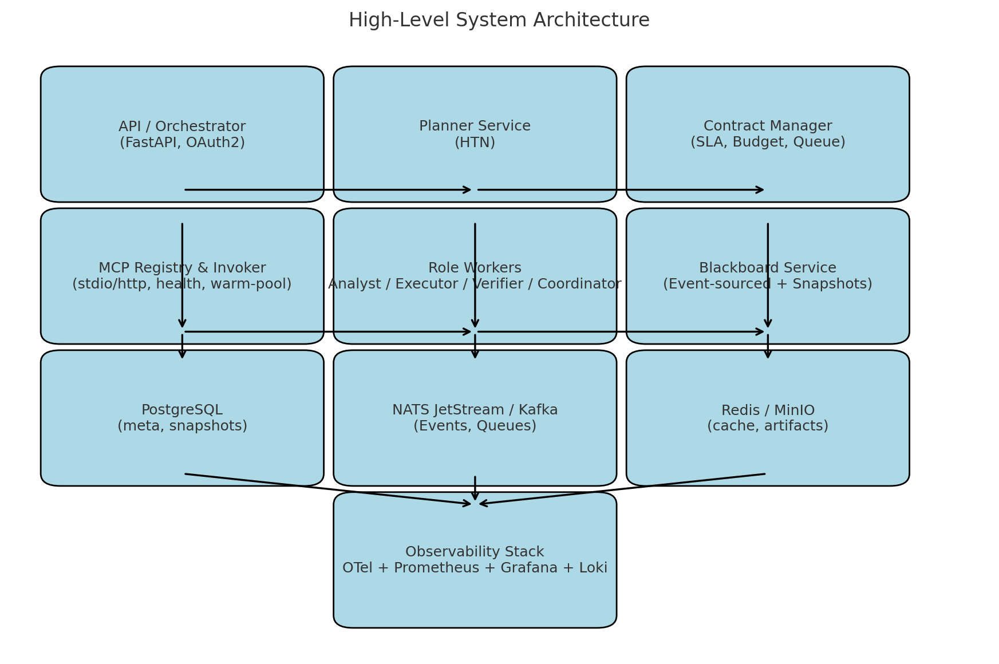

# ARCHITECTURE.md — Архитектура многоагентной системы (HTN + Роли + Контракты + MCP)

**Связанные документы:** [design_doc.md](design_doc.md) • [CONTRACTS.md](CONTRACTS.md) • [TOOLS.md](TOOLS.md)

## 1. Обзор
Система выполняет цели пользователя через иерархическую декомпозицию (HTN). Листовые действия — вызовы **MCP‑серверов** (инструментов). Управление ведётся через контракты, ресурсы спускаются сверху вниз, результаты фиксируются в общем контексте (**Blackboard**).

**Ключевые свойства:** наблюдаемость, воспроизводимость (deterministic‑mode), безопасность (sandbox MCP), масштабируемость (горизонтальная), изоляция ресурсов, формальные контракты.

## 2. Технологический стек

### 2.1 Языки и рантайм
- **Python 3.12+**: оркестратор, планировщик HTN, верификатор, регистры.
- **asyncio + uvloop**: конкурентные IO‑задачи (MCP http/stdio).
- **FastAPI** (HTTP API) + **pydantic** (валидация схем и контрактов).
- **gRPC (optional)**: внутренние высоконагруженные каналы (планировщик ↔ воркеры).

### 2.2 Хранение данных
- **PostgreSQL 15+**: метаданные планов/контрактов, реестры MCP, снапшоты Blackboard.
- **S3‑совместимое хранилище** (MinIO/S3): крупные артефакты/лог‑приложения.
- **Redis**: кэш, очереди с низкой задержкой, координация локов.
- **Event Store** (Kafka или NATS JetStream): события Blackboard и трассировка.

### 2.3 Очереди и оркестрация выполнения
- **NATS JetStream** (или **Kafka**): event bus, топики `contracts.*`, `mcp.*`, `bb.events`.
- **Воркеры** per‑role (Analyst/Executor/Verifier/Coordinator): процесс‑пулы (Docker).

### 2.4 Наблюдаемость
- **OpenTelemetry**: трассировка (spans по контрактам/инструментам).
- **Prometheus + Grafana**: метрики.
- **Loki (или ELK)**: логи с редактированием секретов.

### 2.5 Деплой и среда
- **Kubernetes** (>=1.28): развёртывание компонентов, HPA/VPA.
- **Helm**: чарт для сервисов и MCP‑серверов.
- **Secrets**: HashiCorp Vault / Kubernetes Secrets.
- **Ingress**: NGINX/Traefik.
- **Service Mesh (optional)**: Istio/Linkerd для mTLS и политики сети.

### 2.6 Безопасность
- **Sandbox MCP**: контейнеры с seccomp/AppArmor, ограничение сети (deny‑by‑default).
- **mTLS** внутри кластера; OAuth2/JWT для внешних API.
- **Политики доступа к Blackboard** через capabilities в контрактах.

## 3. Топология (высокоуровневая)

- **API‑шлюз/Оркестратор**: принимает цели, создаёт планы, публикует контракты в очереди.
- **HTN‑планировщик**: строит/обновляет сеть задач, выбирает методы, ранжирует по стоимости.
- **Менеджер контрактов**: жизненный цикл контрактов, SLA, эскалации.
- **Реестр MCP**: discovery (`tools.list`), схемы, warm‑pool stdio‑серверов.
- **Воркеры ролей**: исполняют контракты в пределах квот (Executor вызывает MCP, Analyst декомпозирует, Verifier проверяет).
- **Blackboard (Event‑sourced + Snapshots)**: общий контекст, снапшоты в Postgres, события в шине.
- **Обсервабилити‑стек**: сбор метрик/логов/трейсов.

## 4. Основные сервисы

### 4.1 API/Orchestrator (FastAPI)
- `POST /goals` — приём целей (goal, params, SLA).
- `GET /plans/{id}` — статус, метрики, снапшот Blackboard.
- `POST /admin/tools` — регистрация MCP‑серверов (только для админов).
- Аутентификация: OAuth2 (OIDC), авторизация: RBAC.

### 4.2 Planner Service
- Реализация HTN: методы, пред/постусловия, селектор по ожидаемой стоимости.
- Реплан при сбоях (tabu‑методы, альтернативные ветви).
- Экспорт плана в дерево контрактов.

### 4.3 Contract Manager
- Статусы: Proposed → … → Settled.
- Аллокатор бюджета/дедлайнов для поддеревьев.
- Backpressure и preemption низкоприоритетных веток.

### 4.4 MCP Registry & Invoker
- Дискавери, кеш схем, healthchecks, warm‑pool процессов (`stdio`).
- Унифицированный вызов: `mcp://server/tool@version` (http/stdio).
- Политики таймаутов/ретраев/circuit‑breaker.

### 4.5 Role Workers
- **Analyst**: генерация подзадач по методам HTN.
- **Executor**: вызовы MCP‑инструментов, публикация результатов.
- **Verifier**: проверка инвариантов/предикатов, аудиторские логи.
- **Coordinator**: перераспределение квот, эскалации.

### 4.6 Blackboard Service
- API снапшотов/истории; версионирование ключей `key@version`.
- Транзакционные записи по контрактам; идемпотентность по `inputs_hash`.
- Экспорт событий в шину (для деривативных индексов/аналитики).

## 5. Данные и схемы
- Контракты — YAML/JSON по схемам pydantic; в БД хранится нормализованный вид + аудит‑журнал.
- События Blackboard — компактный JSON, хранение в JetStream/Kafka + TTL.
- Снимки — Postgres JSONB (индексация по пути ключей).

## 6. Масштабирование
- HPA по метрикам очередей (`lag`), CPU/Memory воркеров, `mcp.call_p95`.
- Разделение по ролям (отдельные deployments), шардирование по планам.
- Warm‑pool MCP stdio‑серверов на узлах с SSD; affinity по данным при необходимости.

## 7. Отказоустойчивость
- Реплики Postgres (sync/async), резервные копии (pgbackrest).
- JetStream/Kafka — кворум, ретеншн по политике.
- Circuit‑breaker на уровне Invoker + реплан альтернатив.
- Deterministic‑mode для воспроизводимых повторов инцидентов.

## 8. SLO/SLA и метрики
- **SLO**: p95 планирования подцели < 500ms; p95 вызова MCP < 2s; успешность плана > 99% при валидном каталоге инструментов.
- **Метрики**: `plan_depth`, `tools_invoked`, `error_rate`, `budget_used%`, `deadline_slack_ms`, `replans`, `bb.write_conflicts`.
- **Алерты**: превышение error_rate MCP, рост `lag` очереди, деградация p95.

## 9. Безопасность и соответствие
- mTLS внутри mesh, OAuth2/OIDC с короткими токенами, аудит.
- Политика секретов: только через Vault, ротация.
- Политики записи в Blackboard через capabilities; верификатор блокирует нарушения.

## 10. Локальная разработка
- **docker compose**: Postgres, NATS JetStream, MinIO, Redis, оркестратор, воркеры, пример MCP‑сервера.
- Фикстуры контрактов и мок‑инструментов.
- Makefile: `make up`, `make seed`, `make test`, `make otel`.

## 11. Версионирование и миграции
- Миграции БД: Alembic.
- Версии методов/инструментов фиксируются в журналах; rollout через feature‑flags и canary.

## 12. Приложения
- Порты по умолчанию: API 8080, OTEL‑collector 4317, NATS 4222/6222/8222.
- Схемы pydantic для контрактов/инвариантов — см. [CONTRACTS.md](CONTRACTS.md).
- Регистрация MCP и каталоги операций — см. [TOOLS.md](TOOLS.md).
